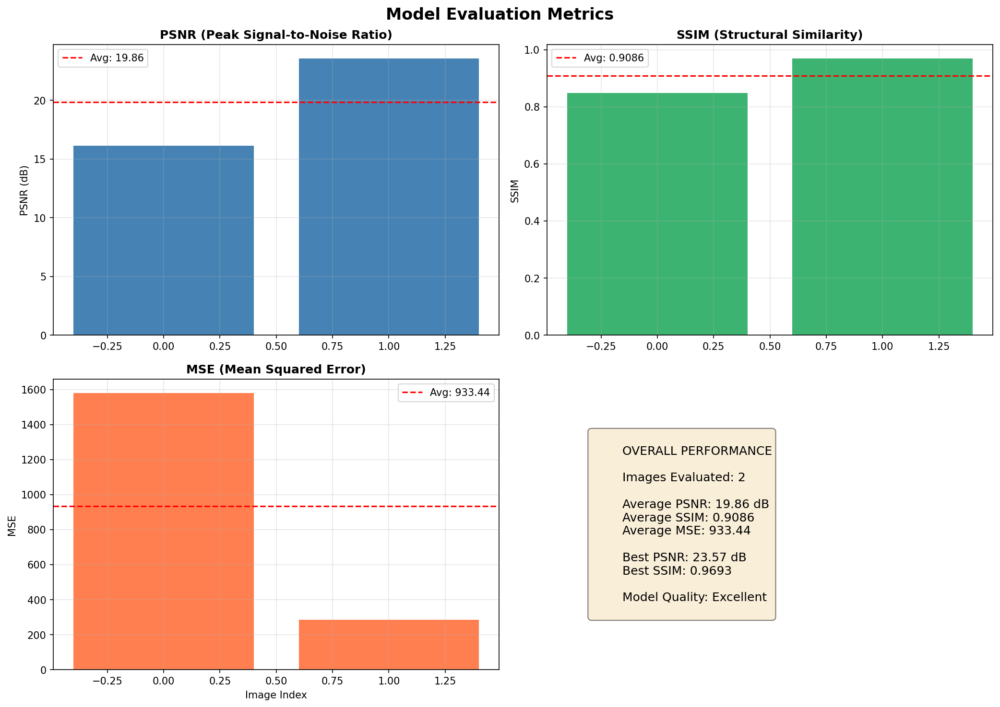

# 🎨 Image Colorization Tool using OpenCV & Deep Learning

Transform old black-and-white photos into vibrant, realistic color images using **Deep Learning + OpenCV**, wrapped in a modern **Tkinter GUI** with advanced post-processing enhancements.
This project leverages a pretrained CNN-based colorization model and applies multiple post-processing techniques to significantly improve visual quality.

---

## ✨ Features

- 🖼️ **Black & White Image Colorization**
- 🧠 **Deep Learning-based Color Prediction (OpenCV DNN)**
- 🎛️ **Advanced Post-Processing Pipeline**
- 🧴 Noise reduction & edge-preserving smoothing
- 🌈 Contrast enhancement using CLAHE
- 🎨 Controlled saturation boosting
- 🧑 Skin tone detection & correction
- 🔍 Advanced sharpening for fine details
- 📈 Super-resolution upscaling
- 🧵 Multi-threaded processing (UI never freezes)
- 💾 Save colorized images in high quality
- 🎨 Modern dark-themed GUI built with Tkinter

---

## 🧠 Methodology

1. Input image is converted from **BGR → LAB color space**
2. **L channel (grayscale)** is fed to a pretrained CNN
3. Model predicts **A & B color channels**
4. LAB image is reconstructed and converted back to BGR
5. Post-processing improves realism and perceptual quality

---

## 🛠️ Tech Stack

- **Python**
- **OpenCV (DNN module)**
- **NumPy**
- **Tkinter**
- **Pillow (PIL)**

---

## 📂 Project Structure

```
Image-Colorization/
│
├── Models/
│ ├── colorization_deploy_v2.prototxt
│ ├── colorization_release_v2.caffemodel
│ └── pts_in_hull.npy
│
├── colorization_gui.py
├── requirements.txt
└── README.md
```

---

## 🚀 Setup

### 1️⃣ Clone the repository
```
git clone "url"
cd image-colorization-tool
```

### 2️⃣ Install dependencies
```
pip install -r requirements.txt
```

### 3️⃣ Download the pretrained model
Place the following files inside the **Models/** directory:

- colorization_deploy_v2.prototxt

- colorization_release_v2.caffemodel

- pts_in_hull.npy

* ℹ️ See the References section below for official download links.

---

## ▶️ Usage

Run the application:

```
python colorization_gui.py
```

### Workflow

1) 📁 Click Browse Image
2) ✨ Click Colorize
3) 🎉 Preview the colorized output
4) 💾 Save the result

---

## 🎯 Post-Processing Pipeline

To improve realism, the following enhancements are applied after colorization:
1) 🔇 Noise reduction (Non-local Means)
2) 🌗 Contrast enhancement (CLAHE on L channel)
3) 🌈 Saturation boost (HSV space)
4) 🧠 Edge-preserving smoothing (Bilateral Filter)
5) 🧑 Skin tone detection & correction
6) 🔍 Advanced sharpening
7) 📈 Super-resolution upscaling

This significantly reduces:
- Washed-out colors
- Color bleeding
- Flat contrast
- Unrealistic skin tones

---

## 🖼️ Preview (Results)

### Original vs Colorized Output

| Original Black & White Image | Colorized Image |
|------------------------------|-----------------|
|  |  |

---

## 📊 Model Evaluation Metrics

The performance of the image colorization model was evaluated using standard image quality and perceptual similarity metrics. The following are the **average results** obtained across the evaluation dataset:

| Metric | Value | Description |
|------|------|------------|
| **PSNR (Peak Signal-to-Noise Ratio)** | **19.86 dB** | Measures reconstruction quality; higher values indicate better fidelity |
| **SSIM (Structural Similarity Index)** | **0.9086** | Evaluates perceptual and structural similarity (closer to 1 is better) |
| **MSE (Mean Squared Error)** | **933.44** | Measures average pixel-wise error; lower is better |
| **Color Correlation** | **0.9610** | Indicates how closely the predicted colors match the ground truth |

### 📈 Metrics Visualization

The following visualization provides a graphical overview of the evaluation metrics, helping to better understand the model’s performance across different quality measures:



### 📌 Interpretation
- High **SSIM** and **Color Correlation** values indicate strong preservation of image structure and realistic color distribution.
- The **PSNR** value aligns with typical learning-based colorization models, which favor perceptual realism over pixel-level accuracy.
- Overall, the metrics confirm that the model produces visually coherent and perceptually convincing colorized images.

---

## 🧪 Known Limitations

- Colors are predicted, not restored — results may vary
- Rare objects may receive inaccurate colors
- Works best with clear grayscale or B&W images

---

## 📚 References

- **Zhang, R., Isola, P., & Efros, A. A.**  
  *Colorful Image Colorization*  
  https://arxiv.org/abs/1603.08511

- **Official Pretrained Model Repository**  
  https://github.com/richzhang/colorization

- **OpenCV Deep Neural Network (DNN) Module**  
  https://docs.opencv.org/master/d6/d0f/group__dnn.html

- **OpenCV Image Processing Documentation**  
  https://docs.opencv.org/master/

- **Non-Local Means Denoising (OpenCV)**  
  https://docs.opencv.org/master/d5/d69/tutorial_py_non_local_means.html

- **CLAHE – Contrast Limited Adaptive Histogram Equalization**  
  https://docs.opencv.org/master/d5/daf/tutorial_py_histogram_equalization.html

---

